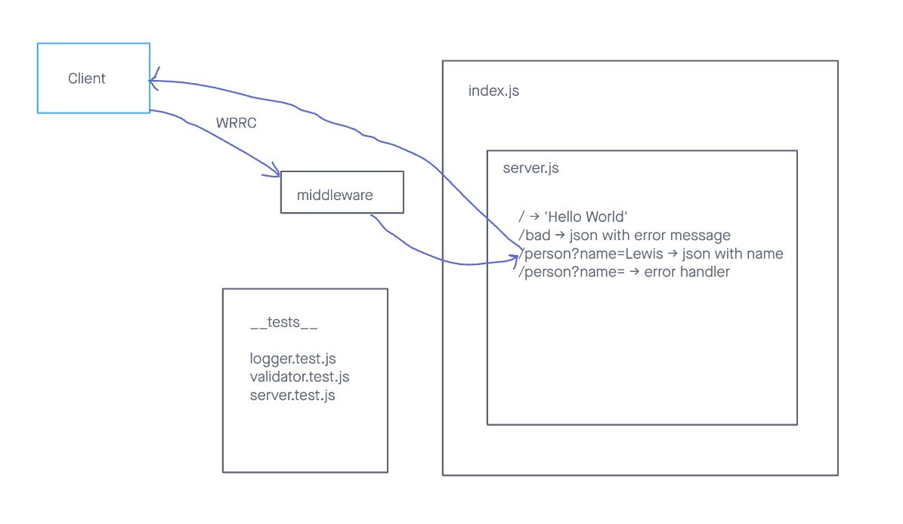

# LAB - 401-D49 Lab-02

## Project: basic-express-server

### Author: Lewis Benson

### Problem Domain

Dynamic API Phase 1: Build your core, standards compliant Express server
From a business requirements standpoint, we will be building a basic Express server using best practices, including server modularization, use of middleware, and tests.

### Links and Resources

- [ci/cd](https://github.com/tm-LBenson/basic-express-server/actions) (GitHub Actions)
- [server-prod](https://four01-d49-basic-server.onrender.com/)

### Setup

#### `.env` requirements (where applicable)

see `.env.sample`

- PORT=3001

#### How to initialize/run your application (where applicable)

- nodemon

#### Features / Routes

- Feature one: Deploy to Prod

- GET : `/` - specific route to hit
- GET : `/bad` - specific route to hit
- GET : `/people?name=string` - specific route to hit (string can be replaced with a name)

-Feature two: Add tests

- Add tests for server
- Add tests for validator
- Add tests for logger

-Feature three: Add Logger

- Add logger.js to add a timestamp to the console when hitting endpoint
- Add validator to send an error when a name is not provided

#### Tests

- How do you run tests?
  - npm test
- Any tests of note?
  - handles root path
  - handles invalid paths
  - handles error code 500
- Describe any tests that you did not complete, skipped, etc

#### UML

Link to an image of the UML for your application and response to events
